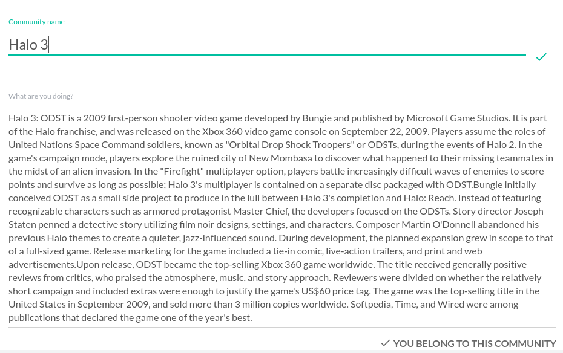
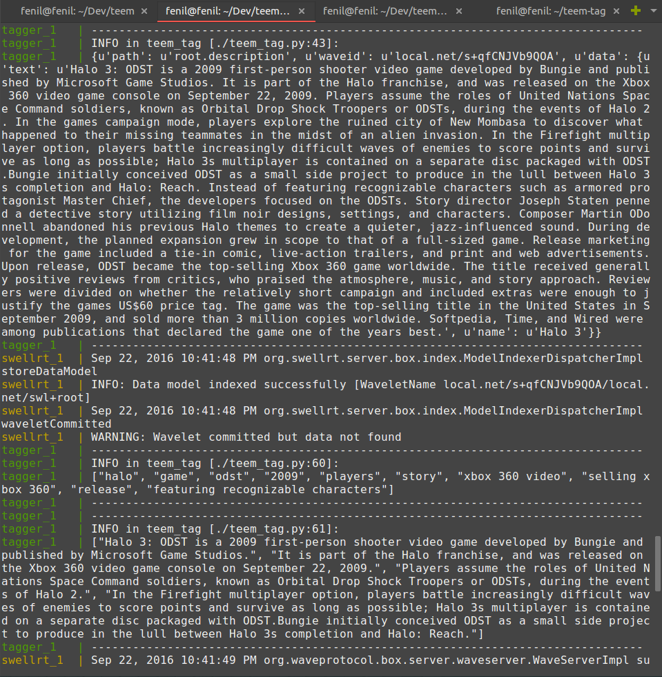

# teem-tag
Module which interacts with [SwellRT](https://swellrt.org/), a project under [P2PValue Project](https://p2pvalue.eu/). Feature-set that it adds to SwellRT ecosystem:
* Automatic keyphrase extraction system. 
* Automatic summarisation. 
* Image Classification.

Made with <3 for open-source. 

## Stats
* This module was awarded the first and the second prize @ SwellRT contest.
* This module is part of the matchmaking proposal for which Prastut got selected as a [Google Summer of Code Student](https://summerofcode.withgoogle.com/projects/#5751555160539136) in 2016, under the organization [Berkman Klein Center for Internet & Society](https://cyber.law.harvard.edu/).
 

Additional Links: 
* [Matchmaking Proposal](https://docs.google.com/document/d/1DwtxhYupN_e8bX13vntU7csiP4hrbZq4MftBJGhE6v0/edit?usp=sharing) for GSoC.
* [Pycon Delhi 2016 Slides](https://in.pycon.org/cfp/2016/proposals/building-an-automatic-keyphrase-extraction-system-using-nltk-in-python~e9g4b/)

## Objective
Our idea is devised from the patterns we observed:
* Since most consumers of SwellRT are normal people, mainly web developers who want to use these applications to reduce their work, so they necessarily wont have the money or the infrastructure or the skills to incorporate machine learning or image processing or natural language.
* The above mentioned technologies and computer sciences are in a lot of demand. These emerging sciences have made new insights which were not possible 5 years back.

So there is this gap or friction between these 2 points. We are trying to create an ecosystem of apps that strengthen the resolve of SwellRT and make it a dominating technology in the field of BaaS. 

## Usecases:
* You want image processing support. Use an app from the ML+NLP ecosytem of SwellRT.
* You want a data science library -> okay done, ping the similar API. 

Though our idea is very small, we believe that this ideology can become a huge opening for developers writing apps for SwellRT. SwellRT stems from the notion of decentralizing, we take it in a very literal way: of decentralizing the skills only available to the privileged people and hand it over to the masses. 

## Architecture
This module heavily uses nltk package for most of it's NLP tasks as well as Tensorflow for image processing and convulutional neural network support. It's build on top of Flask to provide a webserver. The module integrates as a docker container with [SwellRT](http://swellrt.org/), the full-stack backend framework for Teem. Following is a schematic diagram for the same:

## Project Setup

##  Demo

### Text tagging + summarisation

### Image classification demo

## Contributors

* [Fenil Patel](https://github.com/patelfenil)
* [Prastut Kumar](https://github.com/prastut/)
